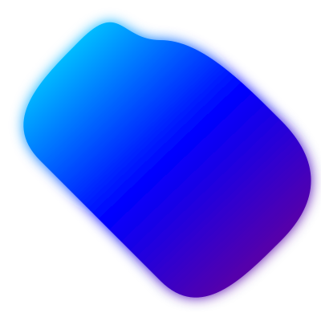

# 🌀 Pulse - Token Creation Platform on Solana



Pulse is an elegant and user-friendly platform for creating tokens on the Solana blockchain. With its intuitive and modern interface, it allows you to create and manage tokens quickly and easily.

## ✨ Current Features

- **Token Creation**: Simple interface for creating tokens on Solana
- **Modern Design**: Elegant UI with animated background and gradient effects
- **Wallet Integration**: Seamless connection with Solana wallets
- **Token Management**: Monitor and manage created tokens

## 🚀 Upcoming Features

- **Telegram Bot**: Automated system for micro purchases and sales
- **Volume Generation**: Functionality to generate trading volume
- **DEX Visibility**: Strategies to increase visibility in DEXs
- **Pump Features**: Tools to optimize front page presence

## 🛠 Technical Stack

- **Frontend**: Next.js 13+ with App Router
- **Styling**: Tailwind CSS with custom animations
- **Blockchain**: Solana Web3.js
- **State Management**: React Context

## 📦 Dependencies

```json
{
  "next": "^13.0.0",
  "react": "^18.0.0",
  "tailwindcss": "^3.0.0",
  "@solana/web3.js": "^1.0.0",
  "@solana/wallet-adapter-react": "^0.15.0"
}
```

## 🔧 Installation

1. Clone the repository:
```bash
git clone https://github.com/yourusername/pulse.git
```

2. Install dependencies:
```bash
npm install
```

3. Run the development server:
```bash
npm run dev
```

## 📁 Project Structure

```
pulse/
├── public/
│   ├── pulse-logo.svg
│   ├── social-icons.svg
│   └── favicon.svg
├── src/
│   ├── app/
│   │   ├── layout.tsx
│   │   ├── page.tsx
│   │   └── globals.css
│   ├── components/
│   │   ├── Countdown.tsx
│   │   ├── TokenCreator.tsx
│   │   └── ...
│   ├── context/
│   │   └── NetworkContext.tsx
│   └── utils/
│       ├── tokenCreation.ts
│       └── tokenStorage.ts
```

## 🔄 Token Creation Flow

1. Connect Wallet
2. Configure Token Parameters
3. Create Token
4. Manage Token

## 🤝 Contributing

Contributions are welcome! Please feel free to submit a Pull Request.

## 📄 License

This project is licensed under the MIT License - see the LICENSE file for details.

